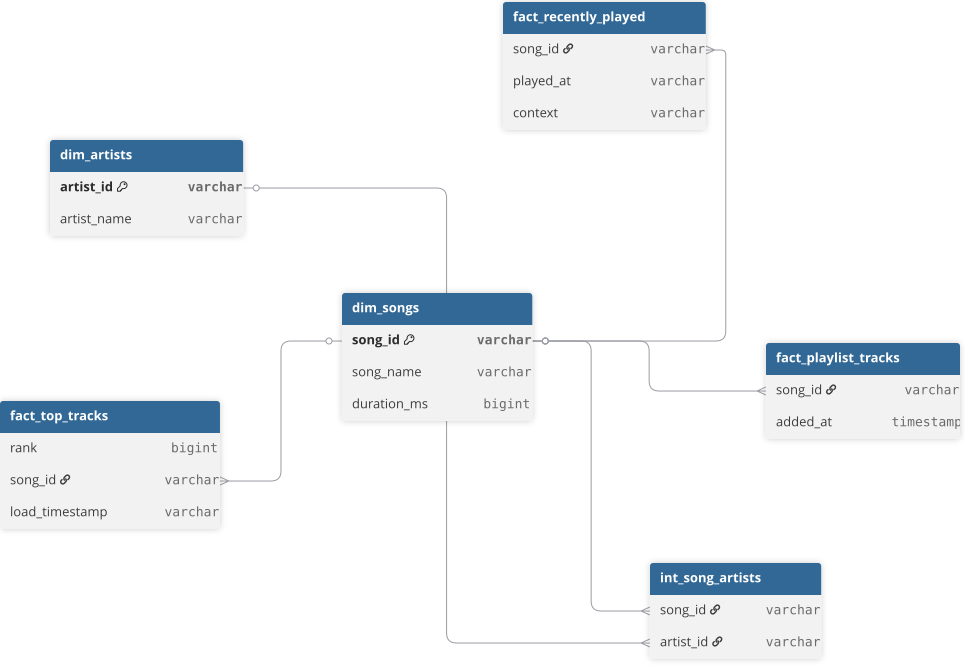

# spotify-dw

Personal data engineering project — Spotify API → DuckDB → dbt → Airflow → BI

## Project overview:

The aim of this project is to step into the field of Data engineering. A personal data engineering project built to analyse my Spotify listening habits and put into practice the core skills of a data engineer. The pipeline extracts data from the Spotify API, loads it into a local DuckDB warehouse, transforms it using dbt, and surfaces insights through an Evidence dashboard — orchestrated end-to-end by Apache Airflow.

This project implements stacks that an actual DE would do; thus learning & tracing the steps needed to upskill into this field. The pipeline extracts data from the Spotify API, loads it into a local DuckDB warehouse, transforms it using dbt, and surfaces insights through an Evidence dashboard: orchestrated end-to-end by Apache Airflow. Spotify was chosen deliberately over publicly available datasets. Working with a live, personal API introduces real engineering challenges such as authentication, pagination, rate limits, and incremental loads which the static datasets don't. The personal nature of the data also provides a genuine incentive to maintain and improve the pipeline over time.

The project mirrors real DE practices throughout: a layered architecture (raw → staging → marts), a star schema data model, separation of concerns between extract, load and transform, and documented architecture decisions for every meaningful choice made along the way. A cloud-hosted version (MotherDuck + managed Airflow) is planned for v2. 

As part of the overview, here is the Architecture for this project: 

<picture>
	<source media="(prefers-color-scheme: dark)" srcset="docs/img/spotify-data-architecture (dark).svg">
	<source media="(prefers-color-scheme: light)" srcset="docs/img/spotify-data-architecture (light).png">
	
</picture>

## Tech stack

Here is the tech stack that would be useful to know. This also includes a 'Why' which is a thought behind each decision. For more detail view: please go to my ADRs here: [decisions.md](decisions.md). 

| Layer | Tool | Why |
|-------|------|-----|
| Extract | Python + Spotify API | Live API introduces real engineering challenges — auth, pagination, rate limits |
| Storage | DuckDB | Zero setup, native JSON support, single file: perfect for local scale with no infrastructure overhead |
| Transform | dbt-duckdb | Industry-standard transformation tool, enforces separation of concerns between raw and business logic |
| Orchestration | Apache Airflow | Industry-standard orchestrator, maps cleanly to individual pipeline tasks |
| Visualisation | Evidence | Code-first, SQL-based, portfolio-visible (No licensing or privacy concerns unlike Tableau Public or Power BI) |

## Here's the project structure that separates different layers 

```
spotify-dw/
├── extract/          # Python scripts for Spotify API extraction
├── load/             # Scripts to load JSON into DuckDB
├── dbt_spotify/      # dbt project: staging, intermediate, marts
│   ├── models/
│   │   ├── staging/
│   │   ├── intermediate/
│   │   └── marts/
├── dags/             # Airflow DAGs
├── spotify-evidence/ # Evidence dashboard
├── data/             # Raw JSON files (gitignored)
├── decisions.md      # Architecture decision log
└── requirements.txt  # Python dependencies
```
## Setup instructions:

Prerequisites

Python 3.11+
WSL2 (Windows users only)
A Spotify account with a registered app. You will need the Client ID and Client Secret in your env

Run dbt against dev by default (`dbt run`) or prod explicitly (`dbt run --target prod`).

**1. Clone the repo**
```bash
git clone https://github.com/nihar-phadnis/spotify-dw.git
cd spotify-dw
```

**2. Create and activate a virtual environment**
```bash
python -m venv .venv
source .venv/bin/activate  # Windows (Git Bash): .venv\Scripts\activate
```

**3. Install dependencies**
```bash
pip install -r requirements.txt
```

**4. Configure credentials**
```bash
cp .env.example .env
```
Fill in your Spotify Client ID, Client Secret and Playlist ID in `.env`

**5. Authenticate with Spotify**
```bash
python extract/init_auth.py
```

**6. Create dbt profiles.yml**
Create `~/.dbt/profiles.yml` manually — see `profiles.yml.example` for the template

**7. Set up Airflow (WSL only)**
```bash
pip install apache-airflow==2.9.1
airflow standalone
```

**8. Trigger the pipeline**
Go to `http://localhost:8080` and trigger `spotify_daily` or `spotify_weekly`
## Environments

The project runs two environments:

| Environment | Database | Purpose |
|-------------|----------|---------|
| dev | `dev.duckdb` | Development and testing |
| prod | `spotify.duckdb` | Production pipeline |

## Data sources: 

This project pulls from three Spotify API endpoints. Required scopes are defined in config.py.

| Endpoint | Description | Frequency |
|----------|-------------|-----------|
| Recently Played | Last 50 tracks played by the user | Daily |
| Top Tracks | Spotify's algorithmic ranking of your most played tracks | Weekly |
| Playlist Tracks | All tracks from a specified playlist | Weekly |

Top Tracks and Playlist Tracks are pulled weekly as both change slowly. Daily ingestion would add noise with minimal new signal (see [ADR-006](decisions.md#adr-006-top-tracks-extract-frequency)). Recently Played is pulled daily to capture fresh listening activity.

## Data model: 



The warehouse follows a star schema design. See [ADR-012](decisions.md#adr-012-star-schema-design-for-transform-layer) for the full reasoning.

**Dimension tables:** sourced from a union of all three endpoints to ensure songs and artists are never lost from the dimension if they drop out of a single source ([ADR-018](decisions.md#adr-018-songs-and-artists-dimensions-sourced-from-union-of-all-endpoints)):

| Table | Description |
|-------|-------------|
| dim_songs | Unique songs across all three endpoints |
| dim_artists | Unique artists across all three endpoints |

**Fact tables:** one row per event, referencing `dim_songs` via `song_id`:

| Table | Description |
|-------|-------------|
| fact_recently_played | Tracks played with timestamp and context |
| fact_top_tracks | Spotify's algorithmic top track rankings |
| fact_playlist_tracks | Tracks in the user's defined playlist |

**Bridge table:** resolves the many-to-many relationship between songs and artists [ADR-013](decisions.md#adr-013-bridge-table-for-song-artist-relationship):

| Table | Description |
|-------|-------------|
| int_song_artists | Maps songs to their associated artists |

## Architecture Decisions

All major decisions made throughout this project are documented as Architecture Decision Records (ADRs) in [decisions.md](decisions.md). These cover tooling choices, schema design, pipeline design, and infrastructure decisions.
